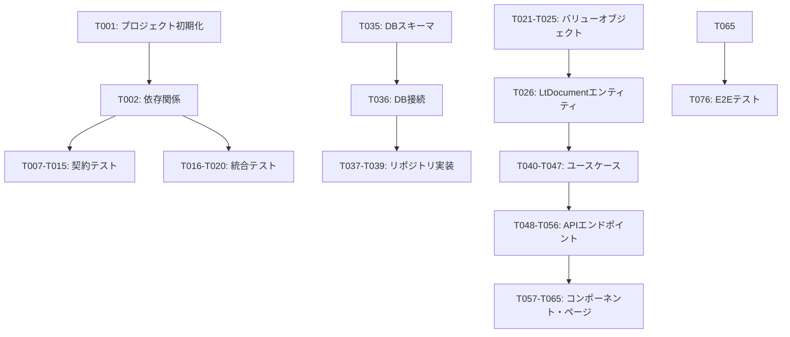

# Tasks: LT資料作成ツール

**Input**: 設計ドキュメント `/specs/001-lt-ltdocumentmaker-lt/`より  
**Prerequisites**: plan.md, research.md, data-model.md, contracts/api-spec.yml, quickstart.md 

## 実行フロー (main)
```
1. plan.mdから技術スタック読み込み完了
   → ✅ Next.js 15+, DDD構成, Drizzle ORM, TailwindCSS, Zod確認
2. 設計ドキュメントの分析完了:
   → ✅ data-model.md: LtDocument, User, Template エンティティ確認
   → ✅ contracts/: 8つのAPIエンドポイント確認
   → ✅ research.md: 技術選定根拠確認
3. タスク生成（カテゴリ別）:
   → ✅ セットアップ: プロジェクト初期化、依存関係、リンティング
   → ✅ テスト: 契約テスト、統合テスト
   → ✅ コア: モデル、サービス、エンドポイント
   → ✅ 統合: DB、ミドルウェア、ロギング
   → ✅ ポリッシュ: 単体テスト、性能、ドキュメント
4. タスクルール適用:
   → ✅ 異なるファイル = [P]で並列マーク
   → ✅ 同一ファイル = 順次実行（[P]なし）
   → ✅ テスト駆動開発（TDD）順序
5. タスク番号付与 (T001, T002...)
6. 依存関係グラフ生成
7. 並列実行例の作成
8. タスク完全性検証: すべての契約とエンティティに対応
9. 戻り値: 成功 (タスク実行準備完了)
```

## フォーマット: `[ID] [P?] Description`
- **[P]**: 並列実行可能（異なるファイル、依存関係なし）
- 記述には正確なファイルパスを含む

## パス規約
DDD構成のNext.js Webアプリケーション:
```
src/
├── app/                    # Next.js App Router
├── domain/                 # Domain Layer (DDD)
├── application/            # Application Layer (DDD)
├── infrastructure/         # Infrastructure Layer (DDD) 
├── presentation/           # Presentation Layer (DDD)
└── shared/                 # Shared Utilities

tests/
├── contract/               # Contract Tests
├── integration/            # Integration Tests
├── unit/                   # Unit Tests
└── e2e/                    # End-to-End Tests
```

## フェーズ 3.1: セットアップ
- [ ] **T001** Next.js 15+ プロジェクト初期化（App Router、TypeScript、TailwindCSS）
- [ ] **T002** 依存関係インストール（Drizzle ORM、Zod、PostgreSQLドライバー、テストライブラリ）
- [ ] **T003** [P] ESLint、Prettier設定ファイル作成
- [ ] **T004** [P] DDD ディレクトリ構造作成（domain/application/infrastructure/presentation）
- [ ] **T005** [P] 環境変数設定（.env.example, .env.local）
- [ ] **T006** [P] Docker Compose設定（PostgreSQL開発環境）

## フェーズ 3.2: テスト優先 (TDD) ⚠️ 3.3より前に必須完了
**重要: これらのテストは実装前に記述し、必ず失敗する状態にすること**

### 契約テスト [P] - APIエンドポイント別
- [ ] **T007** [P] GET /api/documents 契約テスト in `tests/contract/documents-get.test.ts`
- [ ] **T008** [P] POST /api/documents 契約テスト in `tests/contract/documents-post.test.ts`  
- [ ] **T009** [P] GET /api/documents/{documentId} 契約テスト in `tests/contract/documents-get-by-id.test.ts`
- [ ] **T010** [P] PUT /api/documents/{documentId} 契約テスト in `tests/contract/documents-put.test.ts`
- [ ] **T011** [P] DELETE /api/documents/{documentId} 契約テスト in `tests/contract/documents-delete.test.ts`
- [ ] **T012** [P] POST /api/documents/{documentId}/export 契約テスト in `tests/contract/export-post.test.ts`
- [ ] **T013** [P] GET /api/templates 契約テスト in `tests/contract/templates-get.test.ts`
- [ ] **T014** [P] POST /api/generate 契約テスト in `tests/contract/generate-post.test.ts`
- [ ] **T015** [P] POST /api/validate 契約テスト in `tests/contract/validate-post.test.ts`

### 統合テスト [P] - ユーザーストーリー別  
- [ ] **T016** [P] 新規LT文書作成フロー統合テスト in `tests/integration/document-creation.test.ts`
- [ ] **T017** [P] コンテンツ入力・保存フロー統合テスト in `tests/integration/content-editing.test.ts`
- [ ] **T018** [P] 時間制限バリデーション統合テスト in `tests/integration/time-validation.test.ts`
- [ ] **T019** [P] Markdownエクスポート統合テスト in `tests/integration/markdown-export.test.ts`
- [ ] **T020** [P] オフライン編集・同期統合テスト in `tests/integration/offline-sync.test.ts`

## フェーズ 3.3: コア実装（テスト失敗確認後のみ）

### ドメイン層 [P] - エンティティとバリューオブジェクト
- [ ] **T021** [P] DocumentId バリューオブジェクト in `src/domain/value-objects/DocumentId.ts`
- [ ] **T022** [P] DocumentTitle バリューオブジェクト in `src/domain/value-objects/DocumentTitle.ts`
- [ ] **T023** [P] DocumentContent バリューオブジェクト in `src/domain/value-objects/DocumentContent.ts`
- [ ] **T024** [P] DocumentMetadata バリューオブジェクト in `src/domain/value-objects/DocumentMetadata.ts`
- [ ] **T025** [P] Template バリューオブジェクト in `src/domain/value-objects/Template.ts`
- [ ] **T026** LtDocument エンティティ in `src/domain/entities/LtDocument.ts`（T021-T025依存）
- [ ] **T027** [P] User エンティティ in `src/domain/entities/User.ts`
- [ ] **T028** [P] DocumentRepository インターフェース in `src/domain/repositories/DocumentRepository.ts`
- [ ] **T029** [P] UserRepository インターフェース in `src/domain/repositories/UserRepository.ts`
- [ ] **T030** [P] TemplateRepository インターフェース in `src/domain/repositories/TemplateRepository.ts`
- [ ] **T031** [P] DocumentGenerationService ドメインサービス in `src/domain/services/DocumentGenerationService.ts`

### 共通型・バリデーション [P]
- [ ] **T032** [P] Zodスキーマ定義 in `src/shared/types/validation.ts`
- [ ] **T033** [P] TypeScript型定義 in `src/shared/types/index.ts`
- [ ] **T034** [P] 定数・列挙型定義 in `src/shared/constants/index.ts`

### インフラ層 - データベース・リポジトリ
- [ ] **T035** Drizzle ORMスキーマ定義 in `src/infrastructure/database/schema.ts`
- [ ] **T036** データベース接続設定 in `src/infrastructure/database/connection.ts`（T035依存）
- [ ] **T037** DocumentRepository実装 in `src/infrastructure/repositories/DocumentRepository.ts`（T035-T036依存）
- [ ] **T038** [P] UserRepository実装 in `src/infrastructure/repositories/UserRepository.ts`（T035-T036依存）
- [ ] **T039** [P] TemplateRepository実装 in `src/infrastructure/repositories/TemplateRepository.ts`（T035-T036依存）

### アプリケーション層 - ユースケース
- [ ] **T040** [P] CreateDocumentUseCase in `src/application/use-cases/CreateDocumentUseCase.ts`
- [ ] **T041** [P] UpdateDocumentUseCase in `src/application/use-cases/UpdateDocumentUseCase.ts`
- [ ] **T042** [P] GetDocumentUseCase in `src/application/use-cases/GetDocumentUseCase.ts`
- [ ] **T043** [P] ListDocumentsUseCase in `src/application/use-cases/ListDocumentsUseCase.ts`
- [ ] **T044** [P] DeleteDocumentUseCase in `src/application/use-cases/DeleteDocumentUseCase.ts`
- [ ] **T045** [P] ExportDocumentUseCase in `src/application/use-cases/ExportDocumentUseCase.ts`
- [ ] **T046** [P] GenerateDocumentUseCase in `src/application/use-cases/GenerateDocumentUseCase.ts`
- [ ] **T047** [P] ValidateContentUseCase in `src/application/use-cases/ValidateContentUseCase.ts`

### API エンドポイント（Next.js App Router）
- [ ] **T048** GET /api/documents in `src/app/api/documents/route.ts`（T043依存）
- [ ] **T049** POST /api/documents in `src/app/api/documents/route.ts`（T040依存）
- [ ] **T050** GET /api/documents/[documentId] in `src/app/api/documents/[documentId]/route.ts`（T042依存）
- [ ] **T051** PUT /api/documents/[documentId] in `src/app/api/documents/[documentId]/route.ts`（T041依存）
- [ ] **T052** DELETE /api/documents/[documentId] in `src/app/api/documents/[documentId]/route.ts`（T044依存）
- [ ] **T053** POST /api/documents/[documentId]/export in `src/app/api/documents/[documentId]/export/route.ts`（T045依存）
- [ ] **T054** [P] GET /api/templates in `src/app/api/templates/route.ts`
- [ ] **T055** [P] POST /api/generate in `src/app/api/generate/route.ts`（T046依存）
- [ ] **T056** [P] POST /api/validate in `src/app/api/validate/route.ts`（T047依存）

### プレゼンテーション層 - React Components
- [ ] **T057** [P] DocumentForm コンポーネント in `src/presentation/components/DocumentForm.tsx`
- [ ] **T058** [P] DocumentList コンポーネント in `src/presentation/components/DocumentList.tsx`
- [ ] **T059** [P] TemplateSelector コンポーネント in `src/presentation/components/TemplateSelector.tsx`
- [ ] **T060** [P] ContentEditor コンポーネント in `src/presentation/components/ContentEditor.tsx`
- [ ] **T061** [P] ExportButton コンポーネント in `src/presentation/components/ExportButton.tsx`
- [ ] **T062** [P] ValidationDisplay コンポーネント in `src/presentation/components/ValidationDisplay.tsx`

### Next.js ページ
- [ ] **T063** メインページ in `src/app/page.tsx`（T058依存）
- [ ] **T064** 文書作成ページ in `src/app/documents/new/page.tsx`（T057, T059依存）
- [ ] **T065** 文書詳細・編集ページ in `src/app/documents/[documentId]/page.tsx`（T060, T061, T062依存）

## フェーズ 3.4: 統合・ミドルウェア
- [ ] **T066** Next.js middleware設定（CORS、認証）in `src/middleware.ts`
- [ ] **T067** エラーハンドリングミドルウェア in `src/app/api/middleware/errorHandler.ts`
- [ ] **T068** リクエスト/レスポンスロギング in `src/infrastructure/logging/apiLogger.ts`
- [ ] **T069** localStorage同期ユーティリティ in `src/presentation/utils/localStorageSync.ts`
- [ ] **T070** Markdown生成ユーティリティ（Notion互換） in `src/infrastructure/utils/markdownGenerator.ts`

## フェーズ 3.5: ポリッシュ・最適化

### 単体テスト [P]
- [ ] **T071** [P] バリューオブジェクト単体テスト in `tests/unit/value-objects.test.ts`
- [ ] **T072** [P] エンティティ単体テスト in `tests/unit/entities.test.ts`  
- [ ] **T073** [P] ドメインサービス単体テスト in `tests/unit/domain-services.test.ts`
- [ ] **T074** [P] ユースケース単体テスト in `tests/unit/use-cases.test.ts`
- [ ] **T075** [P] バリデーション単体テスト in `tests/unit/validation.test.ts`

### E2Eテスト・性能テスト
- [ ] **T076** 全体ユーザーフロー E2Eテスト in `tests/e2e/user-flow.test.ts`
- [ ] **T077** 文書生成性能テスト（500ms以下） in `tests/performance/generation.test.ts`
- [ ] **T078** ページ読み込み性能テスト（2秒以下） in `tests/performance/loading.test.ts`

### ドキュメント・設定
- [ ] **T079** [P] README.md更新（セットアップ・使用方法）
- [ ] **T080** [P] API仕様書生成（OpenAPI→HTML）
- [ ] **T081** [P] 型定義エクスポート設定
- [ ] **T082** [P] 本番ビルド最適化設定

### データベース・デプロイ準備  
- [ ] **T083** データベースマイグレーション実行 in `migrations/001_initial_schema.sql`
- [ ] **T084** シードデータ作成 in `src/infrastructure/database/seeds.ts`
- [ ] **T085** Docker本番イメージ設定 in `Dockerfile`
- [ ] **T086** GitHub Actions CI/CD設定 in `.github/workflows/deploy.yml`

## 依存関係


## 並列実行例
```bash
# フェーズ 3.2 テスト（T007-T020）並列実行:
Task: "GET /api/documents 契約テスト in tests/contract/documents-get.test.ts"
Task: "POST /api/documents 契約テスト in tests/contract/documents-post.test.ts" 
Task: "新規LT文書作成フロー統合テスト in tests/integration/document-creation.test.ts"
Task: "コンテンツ入力・保存フロー統合テスト in tests/integration/content-editing.test.ts"

# フェーズ 3.3 バリューオブジェクト（T021-T025）並列実行:
Task: "DocumentId バリューオブジェクト in src/domain/value-objects/DocumentId.ts"
Task: "DocumentTitle バリューオブジェクト in src/domain/value-objects/DocumentTitle.ts"
Task: "DocumentContent バリューオブジェクト in src/domain/value-objects/DocumentContent.ts"

# フェーズ 3.3 ユースケース（T040-T047）並列実行:
Task: "CreateDocumentUseCase in src/application/use-cases/CreateDocumentUseCase.ts"
Task: "UpdateDocumentUseCase in src/application/use-cases/UpdateDocumentUseCase.ts"
Task: "GetDocumentUseCase in src/application/use-cases/GetDocumentUseCase.ts"
```

## 注意事項
- **[P] タスク** = 異なるファイル、依存関係なし、並列実行可能
- **テスト駆動**: 実装前にテストが失敗することを確認
- **各タスク後にコミット**: 増分的な進行管理
- **回避事項**: 曖昧なタスク、同一ファイル競合

## タスク生成ルール検証
*main() 実行中に適用*

1. **契約から**: 
   ✅ 9つの契約ファイル → 9つの契約テストタスク [P]
   ✅ 各エンドポイント → 実装タスク

2. **データモデルから**:
   ✅ 3つのエンティティ (LtDocument, User, Template) → モデル作成タスク [P]  
   ✅ 関係性 → サービス層タスク

3. **ユーザーストーリーから**:
   ✅ 5つのストーリー → 統合テストタスク [P]
   ✅ クイックスタートシナリオ → バリデーションタスク

4. **順序付け**:
   ✅ セットアップ → テスト → モデル → サービス → エンドポイント → ポリッシュ
   ✅ 依存関係による並列実行制限

## バリデーションチェックリスト
*main() が戻り値を返す前にチェック*

- ✅ すべての契約に対応するテストあり（T007-T015）
- ✅ すべてのエンティティにモデルタスクあり（T021-T027）  
- ✅ すべてのテストが実装前に配置（フェーズ 3.2 → 3.3）
- ✅ 並列タスクが真に独立（異なるファイルパス）
- ✅ 各タスクが正確なファイルパスを指定
- ✅ 同一ファイルを変更する[P]タスクなし

---
**総タスク数**: 86タスク  
**推定実装期間**: 4-6週間（1人）、2-3週間（チーム）  
**次フェーズ**: T001から順次実行開始